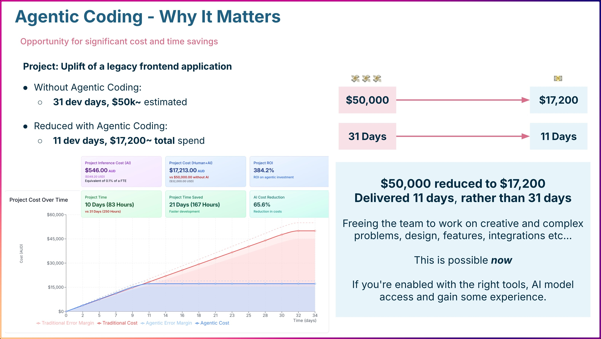
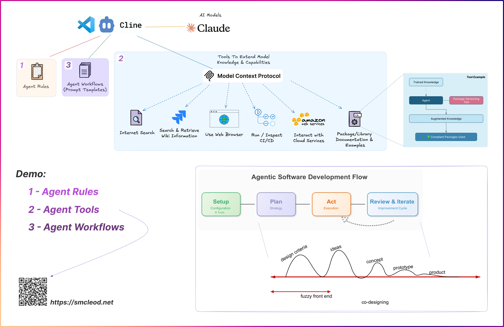

# Agentic Coding Demo Repo

This repo is designed to be a deliberately poor quality codebase for use with demonstrating agentic coding tools, workflows and MCP servers.

Requirements:

- NodeJS installed (Current stable (24), but 22 should work)
- Agentic coding tool, prefferbily Claude Code or Cline
- Ideally have the context7 and playwright MCP servers installed, but these aren't strictly required

## Demo Quick Start

Before starting:

- Do an `npm install`
- Ensure you have any MCP servers you want to demonstrate configured and working (see [`.mcp.json`](.mcp.json))

Demo:

1. Talk to the two images below.
2. Talk to the setup -> plan -> act -> iterate workflow.
3. Tell the audience that this repo is a deliberately poor codebase that you'll show the agent uplifting after creating a dev plan.
4. Prompt the agent with details on what you want to achieve (e.g. "`The goal for today is to plan an uplift of this codebase. We want to ensure the code follows typescript best practices, upgrade all packages to the latest stable versions, fix image 404s, then ensure the application passes linting, builds and runs without issue. Please review the current codebase with this in mind. Think deeply about the current state and the requirements I've set out and give me a concise summary of your recommended changes. Do not make any code changes yet.`"
5. Ensure the agent understands and then prompt it to "`Create a new markdown file called DEVELOPMENT_PLAN.md with all the relevant context and requirements we've discussed, then add a **checklist of development tasks to complete the work in phases**. Then stop for me to review.`"
6. Review the plan with the auidence, make any changes (usually I add "STOP and wait for human review" at the end of each phase).
7. Start a fresh session with the agent
8. Prompt the agent to "`Read the DEVELOPMENT_PLAN.md and confirm it understands the goal and the tasks to get there. Ask any clarifying questions if anything is unclear.`"
9. Answer any relevant questions, then prompt the agent to "`Complete the first phase of tasks in the development plan.`"
10. Talk through the agent making changes and any tool usage that occurs.

### Running the application

This is often not required to get the messaging across during the demo, but some times it's helpful if you want to look at the application and ask the audience to suggest more activites for the agent to perform (add features etc...).

1. `npm install`
2. `npm run build`
3. `npm run dev`
4. Open http://localhost:3000

---

## Introduction / Overview

## Example Files

### Example Dev Plans

These are "here's one I prepared earlier" development plans that you might get a coding agent to create.

- [./docs/examples/example_TYPESCRIPT_UPLIFT.md](./docs/examples/example_TYPESCRIPT_UPLIFT.md)
- [./docs/examples/example_DEPENDENCY_UPGRADE_PLAN.md](./docs/examples/example_DEPENDENCY_UPGRADE_PLAN.md)

### Example Prompts

- [./docs/examples/example_prompts.md](./docs/examples/example_prompts.md)

### Example MCP Configuration

- [./docs/examples/example_mcp_config.json](./docs/examples/example_mcp_config.json)

### Agent Rules

- [./docs/examples/claude/example-CLAUDE.md](./docs/examples/claude/example-CLAUDE.md)

### Example Prompt Templates (aka Workflows / Commands)

- [./docs/examples/claude/commands/](./docs/examples/claude/commands/)

---

## Claude Code specific

- [.CLAUDE.md](.CLAUDE.md) some basic Claude rules which aren't so much for demoing but more to make it run smoothly
- [./mcp.json](./mcp.json) MCP Servers enabled specifically for this project, includes Playwright to give claude access to a headless browser
  - Note: There is a known bug where Claude Code may not read project MCP servers (`.mcp.json`) https://github.com/anthropics/claude-code/issues/3321#issuecomment-3403746695, to work around this you can run the following in this projects directory:
    - `claude mcp add --scope local --transport stdio playwright npx '@playwright/mcp@latest'`
    - `claude mcp add --scope local --transport http context7 https://mcp.context7.com/mcp`
- [./docs/examples/claude/example-claude.json](./docs/examples/claude/example-claude.json)

### Custom Agents / Sub-Agents

- [./claude/agents/company-researcher.md](./claude/agents/company-researcher.md) - ready to run example, e.g. `"Use the company-researcher agent to research the company Mantel Group"`
- [./docs/examples/claude/agents/](./docs/examples/claude/agents/)

---

## Cline Specific

- [.clinerules](.clinerules) some basic clinerules which aren't so much for demoing but more to make it run smoothly

---

# Links

- https://github.com/sammcj/agentic-coding/ (Agentic Coding rules, workflows and agents)
https://github.com/sammcj/mcp-devtools - Swiss Army knife MCP server for agentic coding
- https://smcleod.net
