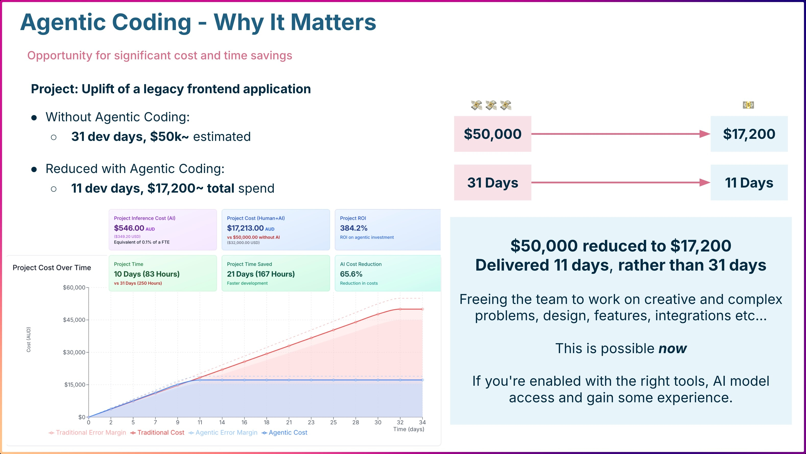
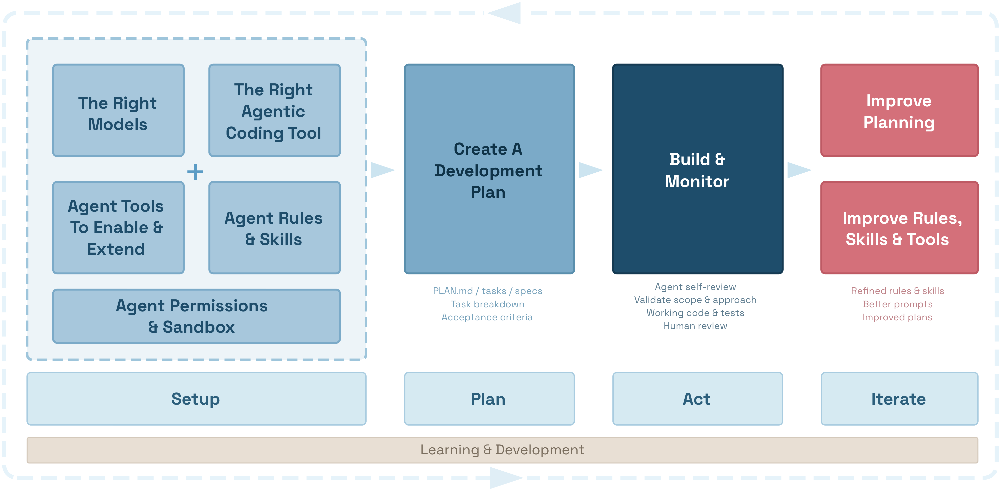

# Agentic Coding Demo Repo

This repo is a deliberately poor quality TypeScript codebase for demonstrating agentic coding tools, workflows, MCP servers, and Claude Code skills/commands.

Requirements:

- NodeJS installed (current stable, 22+)
- Claude Code
- Optional but recommended: the `context7` and `playwright` MCP servers (already configured in [`.mcp.json`](.mcp.json))

## Demo Quick Start

Before starting:

- Run `pnpm install`
- Confirm the MCP servers in [`.mcp.json`](.mcp.json) load (`/mcp` inside Claude Code)

Demo flow:

1. Talk to the two images below, covering the setup -> plan -> act -> iterate workflow.
2. Explain that this is a deliberately poor codebase you'll show the agent uplifting after creating a dev plan.
3. Prompt the agent with what you want to achieve - see [`docs/examples/prompts/simple/1-understand.md`](docs/examples/prompts/simple/1-understand.md)
4. Once it understands, ask it to create the plan - see [`docs/examples/prompts/simple/2-create-plan.md`](docs/examples/prompts/simple/2-create-plan.md)
5. Review the plan with the audience, make changes, or ask the agent to review it - see [`docs/examples/prompts/simple/3-review-plan.md`](docs/examples/prompts/simple/3-review-plan.md)
6. Start a fresh session
7. Prompt the agent to read the plan and start work - see [`docs/examples/prompts/simple/4-act.md`](docs/examples/prompts/simple/4-act.md)
8. Talk through the changes and tool usage as it goes.

If you're stuck, short on time, or your internet is flaky, you can fall back to the prepared plan in [`docs/examples/example_DEVELOPMENT_PLAN.md`](docs/examples/example_DEVELOPMENT_PLAN.md).

### Running the application

Often not needed for the messaging, but useful if you want to show the app and ask the audience for feature ideas.

1. `pnpm install`
2. `pnpm run dev`
3. Open http://localhost:3000

---

## Introduction / Overview

## Example Files

- Simple prompts: [`docs/examples/prompts/simple/`](docs/examples/prompts/simple/)
- Detailed prompts: [`docs/examples/prompts/detailed/`](docs/examples/prompts/detailed/)

### Example Dev Plans

"Here's one I prepared earlier" plans:

- [`docs/examples/example_DEVELOPMENT_PLAN.md`](docs/examples/example_DEVELOPMENT_PLAN.md)
- [`docs/examples/example_DEPENDENCY_UPGRADE_PLAN.md`](docs/examples/example_DEPENDENCY_UPGRADE_PLAN.md)

### Example Prompts

- [`docs/examples/prompts/misc/example_prompts.md`](docs/examples/prompts/misc/example_prompts.md)

### Agent Rules

- [`docs/examples/claude/example-CLAUDE.md`](docs/examples/claude/example-CLAUDE.md)

### Example Prompt Templates (Workflows / Commands)

- [`docs/examples/claude/commands/`](docs/examples/claude/commands/)

---

## Claude Code specific

- [`CLAUDE.md`](CLAUDE.md) - small set of project rules for the agent
- [`.mcp.json`](.mcp.json) - project-scoped MCP servers (Playwright + context7)
- [`.claude/settings.json`](.claude/settings.json) - permissions (allow/ask/deny) and sandbox config
- [`.claude/agents/`](.claude/agents/), [`.claude/commands/`](.claude/commands/), [`.claude/skills/`](.claude/skills/) - project-scoped agents, slash commands and skills

### Custom Agents / Sub-Agents

- [`.claude/agents/company-researcher.md`](.claude/agents/company-researcher.md) - example, e.g. `"Use the company-researcher agent to research Mantel Group"`
- More examples in [`docs/examples/claude/agents/`](docs/examples/claude/agents/)

---

# Links

- https://github.com/sammcj/agentic-coding/ - agentic coding rules, workflows and agents
- https://github.com/sammcj/mcp-devtools - swiss-army-knife MCP server for agentic coding
- https://smcleod.net
