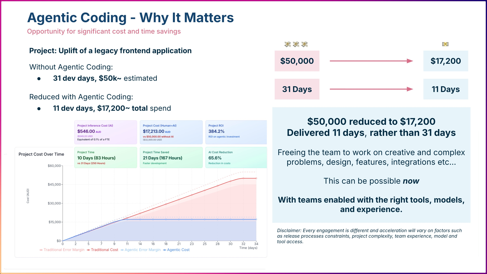
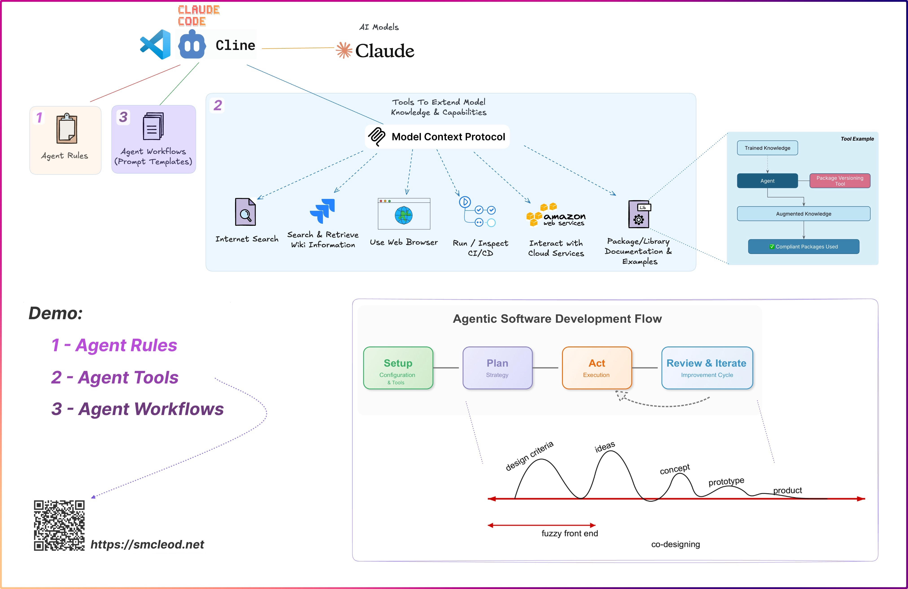

# Agentic Coding Demo Repo

This repo is designed to be a deliberately poor quality codebase for use with demonstrating agentic coding tools, workflows and MCP servers.

Requirements:

- NodeJS installed (Current stable (24), but 22 should work)
- Agentic coding tool, preferably Claude Code or Cline
- Ideally have the context7 and playwright MCP servers installed, but these aren't strictly required

## Demo Quick Start

Before starting:

- Do an `npm install`
- Ensure you have any MCP servers you want to demonstrate configured and working (see [`.mcp.json`](.mcp.json))
  - At a minimum ensure you have context7, web search and web fetch MCP servers configured (or simply mcp-devtools)

Demo:

1. Talk to the two images below, making sure you cover the key components and the setup -> plan -> act -> iterate workflow.
2. You can explain to the audience that this repo is a deliberately poor codebase that you'll show the agent uplifting after creating a dev plan.
3. Prompt the agent with details on what you want to achieve.
    - See [examples/prompts/simple/1-understand.md](examples/prompts/simple/1-understand.md)
4. Ensure the agent understands and then prompt it to create the plan, for example:
    - See [examples/prompts/simple/2-create-plan.md](examples/prompts/simple/2-create-plan.md)
5. Review the plan with the audience, make any changes as required, or ask the agent to do a review:
    - See [examples/prompts/simple/3-review-plan.md](examples/prompts/simple/3-review-plan.md)
6. Start a fresh session with the agent
7. Prompt the agent to read the plan and begin development
    - See [examples/prompts/simple/4-act.md](examples/prompts/simple/4-act.md)
8. Talk through the agent making changes and any tool usage that occurs.

Note: If any any point you get stuck, have unreliable internet or are short on time, you can always talk through an existing development plan created earlier which exists in [./docs/examples/example_TYPESCRIPT_UPLIFT.md](./docs/examples/example_TYPESCRIPT_UPLIFT.md)

### Running the application

This is often not required to get the messaging across during the demo, but some times it's helpful if you want to look at the application and ask the audience to suggest more activities for the agent to perform (add features etc...).

1. `npm install`
2. `npm run build`
3. `npm run dev`
4. Open http://localhost:3000

---

## Introduction / Overview

## Example Files

- Simple prompts: [./docs/examples/prompts/simple/](./docs/examples/prompts/simple/)
- Detailed prompts: [./docs/examples/prompts/detailed/](./docs/examples/prompts/detailed/)

### Example Dev Plans

These are "here's one I prepared earlier" development plans that you might get a coding agent to create.

- [./docs/examples/example_TYPESCRIPT_UPLIFT.md](./docs/examples/example_TYPESCRIPT_UPLIFT.md)
- [./docs/examples/example_DEPENDENCY_UPGRADE_PLAN.md](./docs/examples/example_DEPENDENCY_UPGRADE_PLAN.md)

### Example Prompts

- [./docs/examples/example_prompts.md](./docs/examples/prompts/misc/example_prompts.md)

### Example MCP Configuration

- [./docs/examples/example_mcp_config.json](./docs/examples/example_mcp_config.json)

### Agent Rules

- [./docs/examples/claude/example-CLAUDE.md](./docs/examples/claude/example-CLAUDE.md)

### Example Prompt Templates (aka Workflows / Commands)

- [./docs/examples/claude/commands/](./docs/examples/claude/commands/)

---

## Claude Code specific

- [.CLAUDE.md](.CLAUDE.md) some basic Claude rules which aren't so much for demoing but more to make it run smoothly
- [./mcp.json](./mcp.json) MCP Servers enabled specifically for this project, includes Playwright to give claude access to a headless browser
  - Note: There is a known bug where Claude Code may not read project MCP servers (`.mcp.json`) https://github.com/anthropics/claude-code/issues/3321#issuecomment-3403746695, to work around this you can run the following in this projects directory:
    - `claude mcp add --scope local --transport stdio playwright npx '@playwright/mcp@latest'`
    - `claude mcp add --scope local --transport http context7 https://mcp.context7.com/mcp`
- [./docs/examples/claude/example-claude.json](./docs/examples/claude/example-claude.json)

### Custom Agents / Sub-Agents

- [./claude/agents/company-researcher.md](./claude/agents/company-researcher.md) - ready to run example, e.g. `"Use the company-researcher agent to research the company Mantel Group"`
- [./docs/examples/claude/agents/](./docs/examples/claude/agents/)

---

## Cline Specific

- [.clinerules](.clinerules) some basic clinerules which aren't so much for demoing but more to make it run smoothly

---

# Links

- https://github.com/sammcj/agentic-coding/ (Agentic Coding rules, workflows and agents)
https://github.com/sammcj/mcp-devtools - Swiss Army knife MCP server for agentic coding
- https://smcleod.net
