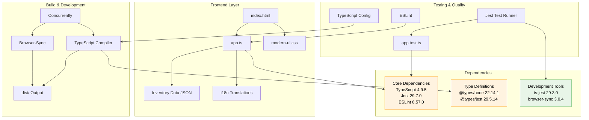

# Dependency Upgrade Plan - TypeScript Uplift Project

The goal is to complete the tasks in a phased approach, marking off completed items as you go.

## Application Architecture

## Current Dependency Status

### 🔴 Critical Updates Required (Major Version Changes)
| Package                          | Current | Latest | Impact Level                                         |
|----------------------------------|---------|--------|------------------------------------------------------|
| typescript                       | 4.9.5   | 5.8.3  | **HIGH** - Major language features, breaking changes |
| eslint                           | 8.57.0  | 9.29.0 | **HIGH** - Configuration format changes              |
| jest                             | 29.7.0  | 30.0.1 | **MEDIUM** - Test framework updates                  |
| jest-environment-jsdom           | 29.7.0  | 30.0.1 | **MEDIUM** - Must match Jest version                 |
| @types/jest                      | 29.5.14 | 30.0.0 | **MEDIUM** - Type definitions for Jest               |
| @typescript-eslint/eslint-plugin | 7.13.0  | 8.34.1 | **MEDIUM** - ESLint rules for TypeScript             |
| @typescript-eslint/parser        | 7.13.0  | 8.34.1 | **MEDIUM** - TypeScript parser for ESLint            |
| @types/node                      | 22.14.1 | 24.0.3 | **LOW** - Node.js type definitions                   |

### 🟡 Minor Updates Available
| Package                   | Current | Latest | Impact Level                 |
|---------------------------|---------|--------|------------------------------|
| @testing-library/jest-dom | 6.6.0   | 6.6.3  | **LOW** - Bug fixes only     |
| ts-jest                   | 29.3.0  | 29.4.0 | **LOW** - Minor improvements |

### ✅ Up to Date
- browser-sync (3.0.4)
- concurrently (9.1.2)
- http-server (14.1.1)

## Development Plan (Implementation Checklist)

### Phase 1: Foundation Updates (Low Risk)
**Objective:** Update minor versions and prepare for major changes

#### Tasks
- [ ] Update minor version packages first
- [ ] Verify application functionality remains intact
- [ ] Update Node.js types to latest LTS-compatible version (no newer than v22.x)

**Verification Steps:**
- [ ] Run `npm run build` - ensure compilation succeeds
- [ ] Run `npm run test` - ensure tests pass
- [ ] Run `npm run dev` - verify application loads correctly
- [ ] Test inventory lookup functionality in browser
- [ ] Verify styling and layout remain consistent

### Phase 2: TypeScript Core Update (Medium Risk)
**Objective:** Upgrade TypeScript to latest stable version

#### Pre-upgrade Tasks
- [ ] Review TypeScript 5.x breaking changes documentation
- [ ] Backup current tsconfig.json
- [ ] Update tsconfig.json for TypeScript 5.x compatibility

#### Upgrade Tasks
- [ ] Update TypeScript to 5.8.3
- [ ] Update @types/node to version compatible with TypeScript 5.x
- [ ] Fix any compilation errors that arise
- [ ] Perform a critical self-review of your changes and fix any issues discovered relating to your changes
- [ ] STOP and wait for human review

**Verification Steps:**
- [ ] Run `npm run build` - resolve any TypeScript compilation errors
- [ ] Run `npm run lint` - address any new linting issues
- [ ] Run `npm run test` - ensure tests still pass
- [ ] Run `npm run dev` - verify application functionality
- [ ] Test all inventory features in browser
- [ ] Verify UI styling and responsiveness

### Phase 3: Testing Framework Update (Medium Risk)
**Objective:** Upgrade Jest ecosystem to version 30.x

#### Pre-upgrade Tasks
- [ ] Review Jest 30.x migration guide
- [ ] Backup jest.config.js

#### Upgrade Tasks
- [ ] Update Jest core and related packages
- [ ] Update Jest configuration if needed
- [ ] Update test files for any breaking changes

**Verification Steps:**
- [ ] Run `npm run test` - ensure all tests pass
- [ ] Run `npm run test:coverage` - verify coverage reporting works
- [ ] Run `npm run build` - ensure no build issues
- [ ] Run `npm run dev` - verify application functionality
- [ ] Test inventory lookup and display features
- [ ] Perform a critical self-review of your changes and fix any issues discovered relating to your changes
- [ ] STOP and wait for human review

### Phase 4: ESLint Ecosystem Update (High Risk)
**Objective:** Upgrade ESLint and TypeScript ESLint packages

#### Pre-upgrade Tasks
- [ ] Review ESLint 9.x migration guide
- [ ] Review @typescript-eslint 8.x breaking changes
- [ ] Backup .eslintrc.json
- [ ] Plan configuration migration to flat config format

#### Upgrade Tasks
- [ ] Update ESLint to 9.x
- [ ] Update @typescript-eslint packages to 8.x
- [ ] Migrate .eslintrc.json to eslint.config.js (flat config)
- [ ] Update linting rules for new versions

**Verification Steps:**
- [ ] Run `npm run lint` - ensure linting works with new configuration
- [ ] Fix any new linting errors or warnings
- [ ] Run `npm run build` - ensure compilation succeeds
- [ ] Run `npm run test` - ensure tests pass
- [ ] Run `npm run dev` - verify application functionality
- [ ] Test complete inventory management workflow
- [ ] Perform a critical self-review of your changes and fix any issues discovered relating to your changes
- [ ] STOP and wait for human review

### Phase 5: Final Integration Testing
**Objective:** Comprehensive testing of all upgrades together

#### Tasks
- [ ] Run complete test suite
- [ ] Perform end-to-end functionality testing
- [ ] Verify performance hasn't degraded
- [ ] Test in multiple browsers if possible
- [ ] Validate all npm scripts work correctly

**Verification Checklist:**
- [ ] `npm run build` - Clean build with no errors
- [ ] `npm run test` - All tests pass
- [ ] `npm run test:coverage` - Coverage reporting works
- [ ] `npm run lint` - No linting errors
- [ ] `npm run dev` - Development server starts correctly
- [ ] Application loads at http://localhost:8080
- [ ] Inventory sidebar populates correctly
- [ ] Product lookup functionality works
- [ ] Warehouse stock display functions properly
- [ ] Error handling works for invalid SKUs
- [ ] UI styling and layout remain consistent
- [ ] Responsive design still works on mobile
- [ ] Perform a critical self-review of your changes and fix any and all issues discovered
- [ ] STOP and wait for human review

## Risk Mitigation

### Backup Strategy
- [ ] Create git branch for upgrade work
- [ ] Document current working state
- [ ] Keep package-lock.json backup

### Rollback Plan
- [ ] If critical issues arise, revert to previous package.json
- [ ] Restore original configuration files
- [ ] Run `npm ci` to restore exact previous state

### Testing Strategy
- [ ] Test after each phase before proceeding
- [ ] Focus on core inventory functionality
- [ ] Verify UI/UX consistency throughout
- [ ] Test error scenarios and edge cases

## Expected Benefits

### Security Improvements
- Latest TypeScript with security patches
- Updated ESLint with latest security rules
- Current Jest with security fixes

### Performance Enhancements
- TypeScript 5.x compilation improvements
- Jest 30.x performance optimisations
- Better development experience with updated tooling

### Developer Experience
- Modern TypeScript language features
- Improved error messages and diagnostics
- Better IDE support and IntelliSense
- Updated linting rules for code quality

## Post-Upgrade Tasks

### Documentation Updates
- [ ] Update README.md with new requirements
- [ ] Document any configuration changes
- [ ] Update development setup instructions
- [ ] Perform a critical self-review of your changes and fix any issues discovered relating to your changes
- [ ] STOP and wait for human review

### Monitoring
- [ ] Monitor application performance
- [ ] Watch for any runtime issues
- [ ] Collect feedback on development experience

---

**Note:** This plan prioritises security and stability. Each phase includes verification steps to ensure the application continues to function correctly. The phased approach allows for early detection and resolution of issues before they compound. You MUST stop at the end of each phase and ask for human review. Do not deviate from the plan unless required.
